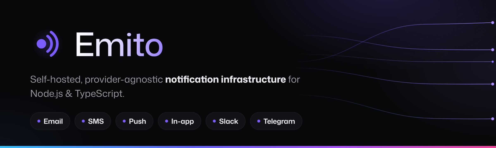
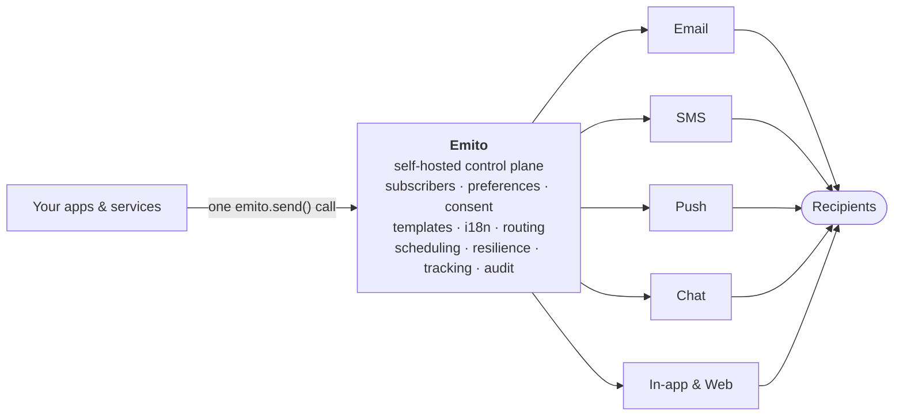
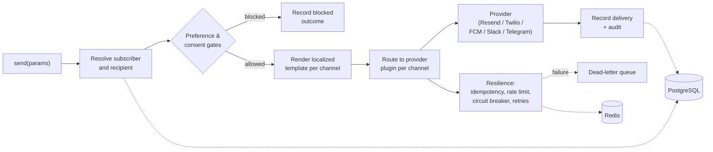
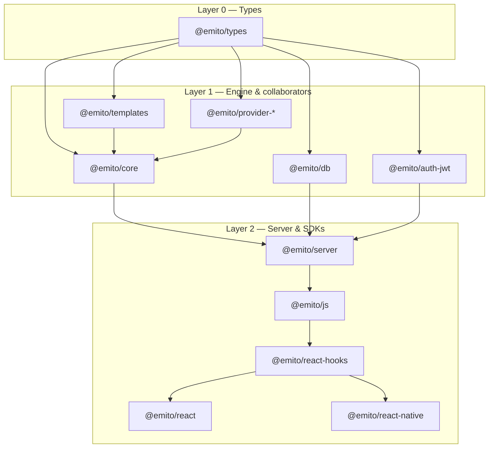

<div align="center">
  

&nbsp;

  [](https://github.com/emito-pro/emito/actions/workflows/ci.yml)
  [](#license)
  [](#)
  [](#)
  [](#)

  [Quickstart](#quickstart) · [Architecture](#architecture) · [Monorepo](#monorepo) · [Documentation](https://docs.emito.io)

</div>

---

## Overview

Emito is notification infrastructure you run yourself. One engine sends across
every channel your users care about — email, SMS, push, in-app, Slack,
Telegram, and more — while respecting per-subscriber preferences, consent, and
workspace boundaries. It backs onto **PostgreSQL** (via Drizzle)
and **Redis** (via ioredis), and ships an embeddable HTTP server and client
SDKs.

> **Why self-hosted and provider-agnostic?** Your notification data —
> subscribers, consent trails, delivery history — stays in your own database.
> Providers are plugins: bring Resend, Twilio, FCM, Slack, or Telegram, or write
> your own to the same `ProviderPlugin` contract. Nothing about your channel
> mix is locked in, and there is no third-party service in the delivery path you
> didn't choose.

A single `send()` call resolves the subscriber, checks preferences and consent,
renders a localized template per channel, routes to the right provider, and
records the result — with idempotency, scheduling, and resilience handled for
you.

Your applications trigger notifications in **one place**. Emito is the control
plane that decides who to reach, on which channels, in what language, and
through which provider — then fans the message out and tracks every delivery.



One integration, many destinations: swap or add providers without touching your
application code — they are plugins behind a single `ProviderPlugin` contract.

## Features

- **Multi-channel.** Email, SMS, push, in-app, Slack, Telegram, and an
  extensible channel/provider model.
- **Provider-agnostic.** Providers are plugins built to one contract. First-party
  plugins for Resend, Twilio, FCM, Slack, and Telegram.
- **Preferences & consent.** Per-subscriber, per-channel preference and consent
  checks are enforced in the send path, with an auditable trail.
- **Workspace-aware.** Workspace scoping runs through the engine and the API,
  and the preference resolver has workspace tiers. It is not
  row-level tenant isolation — keeping one tenant's data away from another stays
  enforced in your own app.
- **Templates & i18n.** Localized, channel-shaped templates with locale
  resolution and channel-specific formatters (HTML email, Slack blocks, Telegram
  HTML).
- **Resilient delivery.** Idempotency keys, scheduling/delay, rate limiting,
  circuit breaking, and dead-letter handling.
- **Embeddable server.** Mount the HTTP API on Node, Fastify, Express, Next.js,
  or Hono.
- **Client SDKs.** Browser/Node JS client plus React, React Native, and React
  hooks for in-app notification UIs over WebSocket, SSE, or polling.

## Providers

Providers are plugins behind a single `ProviderPlugin` contract, so the engine
stays the same no matter how you deliver. The **in-app** channel is served
natively by `@emito/server` (over WebSocket, SSE, or polling) and needs no
third-party provider.

`@emito/server` also *receives* webhooks — signature-verified delivery-status
callbacks from Resend, SendGrid, Twilio, Postmark and Vonage, which feed bounce
and complaint suppression. That is inbound only; an outbound webhook channel,
where Emito posts a notification to an endpoint you own, is still on the
roadmap.

| Channel | Provider | Package | Status |
|---|---|---|---|
| Email | Resend | [`@emito/provider-resend`](./packages/provider-resend/README.md) | ✅ Available |
| Email | SendGrid | `@emito/provider-sendgrid` | 🟡 Planned |
| Email | Amazon SES | `@emito/provider-ses` | 🟡 Planned |
| Email | Postmark | `@emito/provider-postmark` | 🟡 Planned |
| Email | SMTP (Nodemailer) | `@emito/provider-nodemailer` | 🟡 Planned |
| SMS | Twilio | [`@emito/provider-twilio`](./packages/provider-twilio/README.md) | ✅ Available |
| SMS | SMSAPI | [`@emito/provider-smsapi`](./packages/provider-smsapi/README.md) | ✅ Available |
| SMS | Vonage | `@emito/provider-vonage` | 🟡 Planned |
| Push | Firebase Cloud Messaging | [`@emito/provider-fcm`](./packages/provider-fcm/README.md) | ✅ Available |
| Push | Apple Push (APNs) | `@emito/provider-apns` | 🟡 Planned |
| Web Push | Web Push (VAPID) | `@emito/provider-webpush` | 🟡 Planned |
| Slack | Slack | [`@emito/provider-slack`](./packages/provider-slack/README.md) | ✅ Available |
| Telegram | Telegram | [`@emito/provider-telegram`](./packages/provider-telegram/README.md) | ✅ Available |
| Discord | Discord | `@emito/provider-discord` | 🟡 Planned |
| WhatsApp | WhatsApp | `@emito/provider-whatsapp` | 🟡 Planned |
| In-app | — *(native)* | [`@emito/server`](./packages/server/README.md) + client SDKs | ✅ Available |
| Webhook *(outbound)* | — *(native)* | `@emito/server` | 🟡 Planned |

> **✅ Available** ships today as a first-party plugin. **🟡 Planned** is on the
> roadmap; the channel already exists in the engine, so adding the provider is a
> plugin, not a core change. Need one sooner? Implement the `ProviderPlugin`
> contract and register it — no fork required.

## Tech stack


## Architecture

A single `send()` runs through one pipeline. The engine resolves the subscriber,
applies preference and consent gates, renders the per-channel template, routes to
the matching provider, and persists the outcome — backed by Postgres and Redis.



The monorepo is layered. Shared types sit at the base; the core engine and its
collaborators build on them; the server and the SDKs build on the engine.



## Monorepo

Managed with **pnpm** workspaces and **Turborepo**. Requires **Node.js ≥ 22**.

### Packages

| Package | Purpose |
|---|---|
| [`@emito/cli`](./packages/cli/README.md) | The installer CLI: `emito init` detects your stack, installs, migrates, and generates the backend glue. |
| [`@emito/types`](./packages/types/README.md) | Shared types, channel definitions, and schemas — the base layer everything imports. |
| [`@emito/core`](./packages/core/README.md) | The notification engine: `createEmito`, the send/broadcast pipeline, preferences, consent, lifecycle, and observability. |
| [`@emito/db`](./packages/db/README.md) | Drizzle schema, client, repositories, ID generation, and the canonical SQL migrations. |
| [`@emito/templates`](./packages/templates/README.md) | Localized template building, locale resolution, and channel formatters (email layout, Slack blocks, Telegram HTML). |
| [`@emito/auth-jwt`](./packages/auth-jwt/README.md) | JWT auth helpers and HS256 sign/verify for subscriber identity. |
| [`@emito/server`](./packages/server/README.md) | The HTTP API: `createEmitoServer`, router, API-key auth, with Node, Fastify, Express, Next.js, and Hono adapters. |
| [`@emito/js`](./packages/js/README.md) | Browser/Node client: `EmitoClient`, notification/preference/subscription APIs, and WebSocket/SSE/polling transports. |
| [`@emito/react-hooks`](./packages/react-hooks/README.md) | Headless React hooks and provider: `EmitoProvider`, `useNotifications`, `useUnreadCount`, `usePreferences`, `useToast`. |
| [`@emito/react`](./packages/react/README.md) | React components for in-app notifications, built on `@emito/react-hooks`. |
| [`@emito/react-native`](./packages/react-native/README.md) | React Native hooks, including `usePushToken`, sharing the hooks core. |
| [`@emito/provider-kit`](./packages/provider-kit/README.md) | Shared building blocks for writing provider plugins: `defineProvider`, error classification, and test fixtures. |
| [`@emito/provider-resend`](./packages/provider-resend/README.md) | Email provider plugin for Resend. |
| [`@emito/provider-twilio`](./packages/provider-twilio/README.md) | SMS provider plugin for Twilio. |
| [`@emito/provider-smsapi`](./packages/provider-smsapi/README.md) | SMS provider plugin for SMSAPI. |
| [`@emito/provider-fcm`](./packages/provider-fcm/README.md) | Push provider plugin for Firebase Cloud Messaging. |
| [`@emito/provider-slack`](./packages/provider-slack/README.md) | Slack provider plugin. |
| [`@emito/provider-telegram`](./packages/provider-telegram/README.md) | Telegram provider plugin. |

### Apps

| App | Purpose                                                                                                                          |
|---|----------------------------------------------------------------------------------------------------------------------------------|
| [`@emito/demo`](./apps/demo/README.md) | A trading-platform demo exercising the full pipeline as one Docker stack.                                                        |
| [`@emito/docs`](./apps/docs/README.md) | The [docs.emito.io](https://docs.emito.io) documentation site (Astro + Starlight); a standalone app outside the pnpm workspace. |

## Quickstart

### Add Emito to your own app

The recommended way to adopt Emito is the installer CLI,
[`@emito/cli`](./packages/cli/README.md):

```sh
npx @emito/cli@latest init
```

It detects your package manager and backend framework, installs the right
`@emito/*` packages, runs the schema migration, and generates the
`emito.config.ts` + `emito.mount.ts` glue for you to mount. Using an AI coding agent?
`emito agent-skill` installs a skill that runs the CLI *and* wires the mount
call into your entrypoint.

> `npx` is the intended path **once `@emito/*` is published to npm**, which
> hasn't happened yet. Until it does, every package ships as a tarball on each
> [GitHub Release](https://github.com/emito-pro/emito/releases) and installs
> straight from its URL:
>
> ```sh
> pnpm add -D https://github.com/emito-pro/emito/releases/download/v0.1.0/emito-cli-0.1.0.tgz
> pnpm exec emito init
> ```
>
> The packages the CLI installs need one `overrides` block pointing at the same
> release — the [install page](https://docs.emito.io/install/) has it ready to
> paste, and the [CLI README](./packages/cli/README.md#install) covers running
> from a checkout instead.

### Run the monorepo locally

```sh
git clone https://github.com/emito-pro/emito.git
cd emito
pnpm install
```

The fastest way to see the whole platform running against a real PostgreSQL and
Redis is the bundled Docker stack:

```sh
# Builds the image, runs migrations, and seeds demo data on first boot.
docker compose -f docker-compose.demo.yml up -d --build
```

Then open:

| Service | URL |
|---|---|
| Demo app | http://localhost:3100 |

> The stack ships with committed **local-demo** defaults, not production
> secrets. Every value is environment-overridable. See
> [`apps/demo/README.md`](./apps/demo/README.md) for the full environment
> reference and the dev (non-Docker) workflow.

## Contributing

Emito is a pnpm + Turborepo monorepo on **Node.js ≥ 22**.

```sh
pnpm install      # install all workspaces
pnpm build        # build every package (turbo)
pnpm test         # run the test suites (turbo)
pnpm lint         # lint (Biome)
pnpm check        # type-check
```

Work happens on feature branches against `main`. Keep changes scoped to the
package they belong to, add tests for behavior changes, and make sure
`pnpm build`, `pnpm test`, and `pnpm check` pass before opening a pull request —
[CI](./.github/workflows/ci.yml) runs the same gate on Node 22 and 24.

See [`CONTRIBUTING.md`](./CONTRIBUTING.md) for the full guide — dev setup,
coding standards, commit conventions, how to add a provider, and how releases
are cut. Participation is governed by our
[Code of Conduct](./CODE_OF_CONDUCT.md), released changes are recorded in the
[changelog](./CHANGELOG.md), and vulnerabilities go through the private channel
in [`SECURITY.md`](./SECURITY.md) — never a public issue.

## License

MIT.

<div align="center">

  ---

  **Emito** is built and maintained by **SFER LABS LLC** — a software studio
  shipping infrastructure for product teams.

  [Documentation](https://docs.emito.io) · [Issues](../../issues)

  © SFER LABS LLC

</div>
smoke test 2
